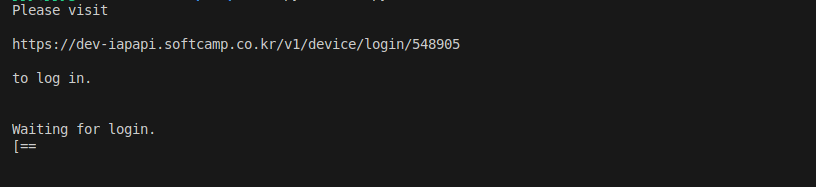
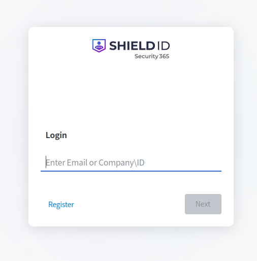
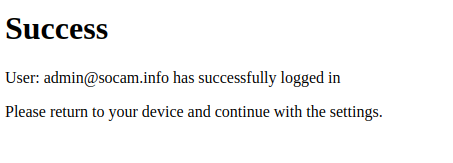
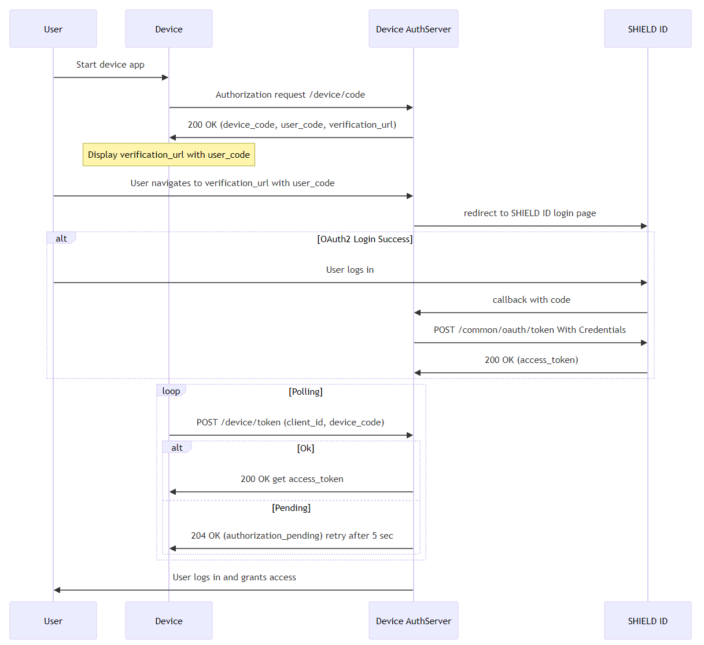

# shieldid
A Python client library for SHIELD ID, compatible with Python 3.7 and above.
SHIELD ID is the IDaaS (Identity as a Service) solution from Security 365 Cloud (https://www.security365.com).

## installation
```bash
pip install shieldid
```

## usage

### device authorization flow

```python
from shieldid import IapBuilder

builder = IapBuilder()
info, ok, err_msg = ( builder.device_authorize("address of SHIELD ID server")
            .build())
if not ok:
    print(err_msg)
else: 
    print(info.get_company_id())  # company id
    print(info.get_access_token())  # access token

```
#### The above code produces the following text as a result:



#### Copy the link and open it in a web browser to see the login screen.



#### The login result is as follows:



### Sequence diagram
