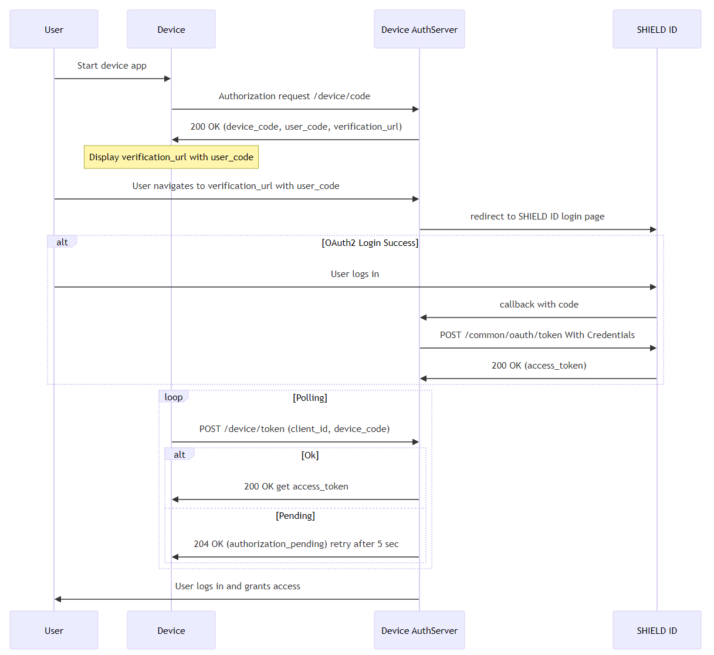
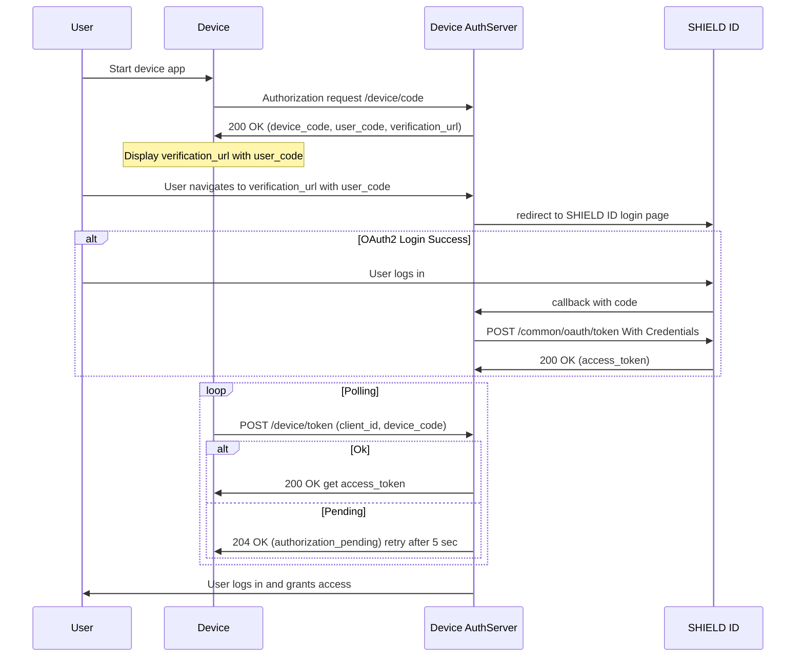

# device authorization flow

```mermaid
sequenceDiagram
participant User
participant Device
participant Device AuthServer
participant SHIELD ID

User->>Device: Start device app
Device->>Device AuthServer: Authorization request /device/code 
Device AuthServer->>Device: 200 OK (device_code, user_code, verification_url)

Note over Device: Display verification_url with user_code
User->>Device AuthServer: User navigates to verification_url with user_code
Device AuthServer->>SHIELD ID: redirect to SHIELD ID login page

alt OAuth2 Login Success
    User->>SHIELD ID: User logs in 
    SHIELD ID->>Device AuthServer: callback with code
    Device AuthServer->>SHIELD ID: POST /common/oauth/token With Credentials
    SHIELD ID->>Device AuthServer: 200 OK (access_token)
end

loop Polling
    Device->>Device AuthServer: POST /device/token (client_id, device_code)
    alt Ok
    Device AuthServer->>Device: 200 OK get access_token
    else Pending
    Device AuthServer->>Device: 204 OK (authorization_pending) retry after 5 sec
    end
end

Device AuthServer->>User: User logs in and grants access
```
